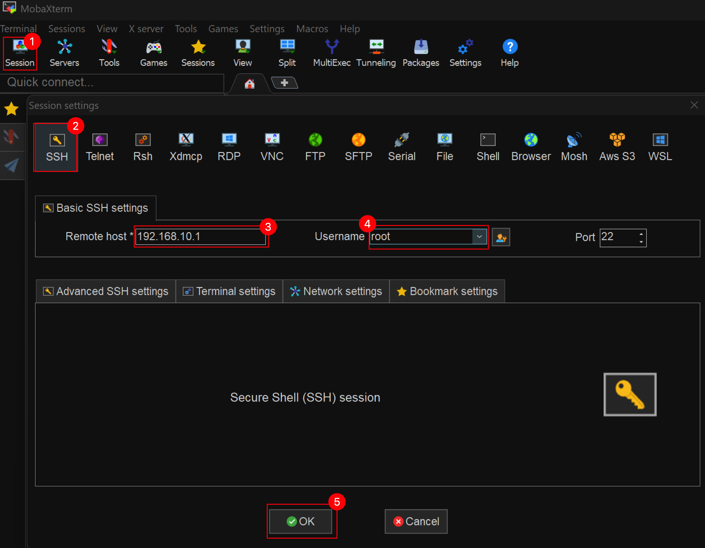
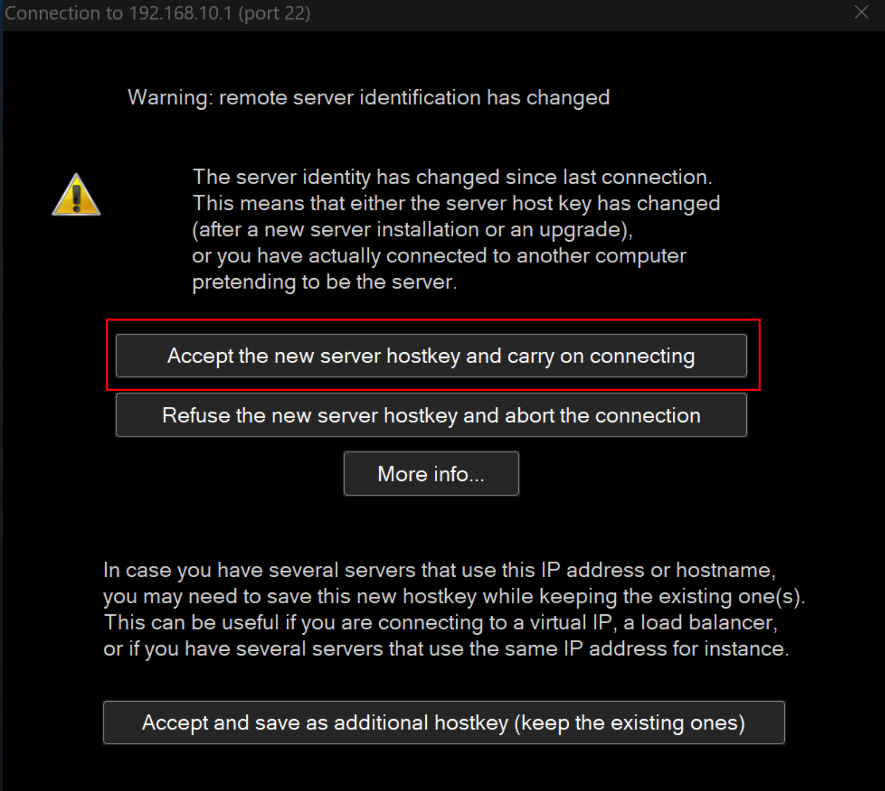
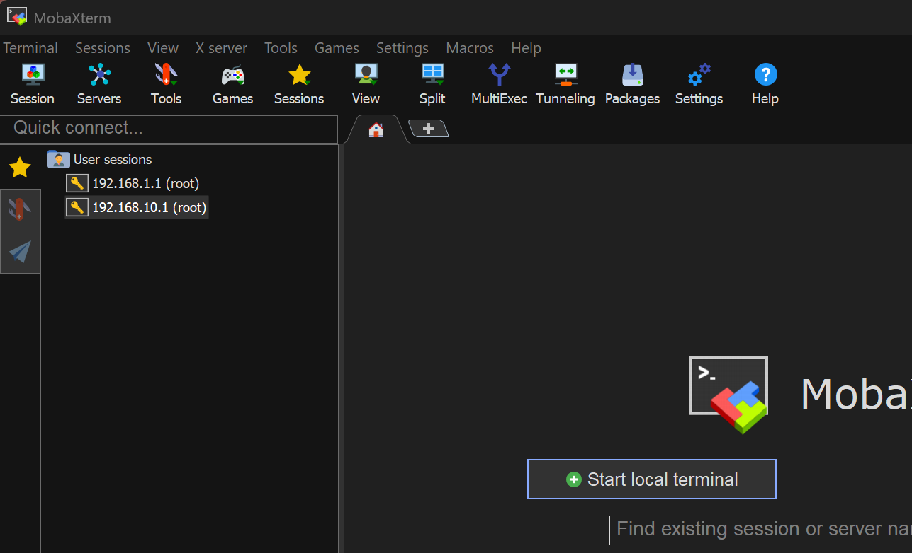
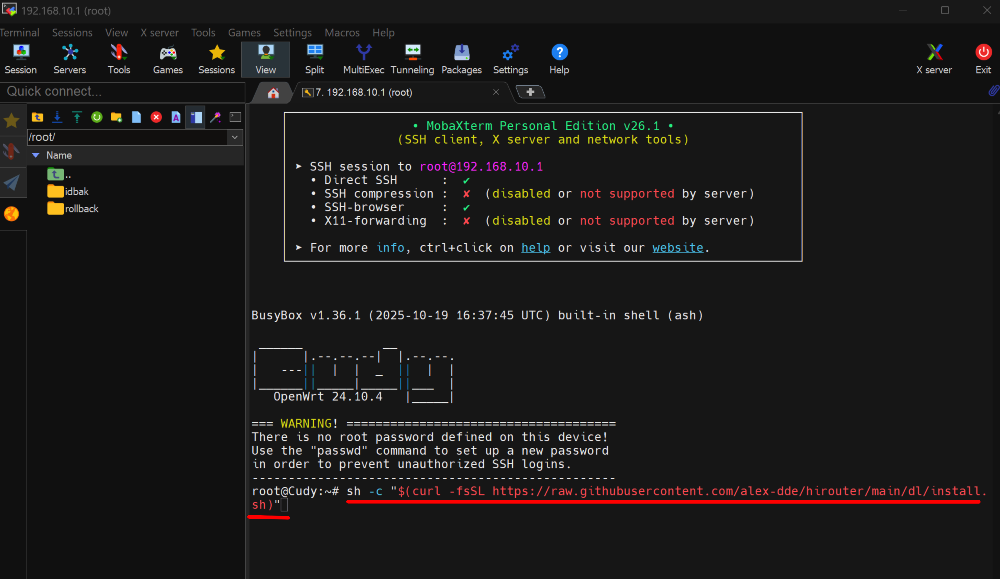
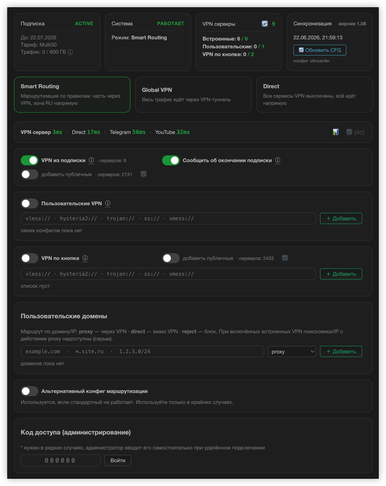

<h1 align="center">🌐 HiRouter</h1>

<p align="center">
  <b>VPN для всей домашней сети, управляемый прямо из веб-интерфейса роутера.</b><br>
  Воткнул роутер — работает весь дом. Без приложений на каждом устройстве.
</p>

<p align="center">
  <a href="https://hirouter.info">🏠 Сайт</a> ·
  <a href="https://hirouter.info/#tariffs">💳 Тарифы</a> ·
  <a href="#-установка">⚡ Установка</a> ·
  <a href="docs/user-guide.md">📖 Руководство</a> ·
  <a href="CHANGELOG.md">📋 История версий</a>
</p>

<p align="center">
  
  
  
  
</p>

---

## 📑 Содержание

| Раздел | О чём |
|---|---|
| [🎯 Что это](#-что-это) | Зачем нужен HiRouter и чем отличается от обычного VPN |
| [⚡ Установка](#-установка) | Одна команда на роутере |
| [🖥 Как выглядит](#-как-выглядит) | Скриншот страницы управления |
| [✨ Возможности](#-возможности) | Что умеет система |
| [💳 Тарифы и подключение](#-тарифы-и-подключение) | Что входит в базовый, что даёт премиум |
| [📦 Что нужно](#-что-нужно) | Поддерживаемое железо и требования |
| [🔍 Проверка](#-проверка-после-установки) | Как убедиться, что всё встало |
| [🧩 Как это устроено](#-как-это-устроено) | Из чего состоит и как связано с панелью |
| [🧭 Режимы маршрутизации](#-режимы-маршрутизации) | Smart Routing, Global VPN, Direct |
| [🔑 Источники VPN-серверов](#-источники-vpn-серверов) | Подписка, свои ключи, публичные, «по кнопке» |
| [⬆️ Обновление](#️-обновление) | По воздуху и переустановкой |
| [🗑 Удаление](#-удаление) | Как снять систему начисто |
| [🛠 Диагностика](#-диагностика) | Что делать, когда пошло не так |

---

## 🎯 Что это

HiRouter — надстройка над OpenWrt. Она добавляет в веб-интерфейс роутера вкладку «HiRouter»,
через которую включается защищённое подключение сразу для **всех** устройств в сети: компьютеров,
телефонов, телевизоров, приставок, консолей, умных колонок.

Обычный VPN приходится ставить и включать на каждом устройстве отдельно — а в телевизор или
приставку его зачастую и не поставить. HiRouter делает это на уровне сети: устройства просто
подключаются к своему Wi-Fi и получают уже отфильтрованный трафик.

Система состоит из двух пакетов:

| Пакет | Что делает |
|---|---|
| 🧠 **Движок** | Ядро **mihomo** — то, что реально гоняет трафик |
| 🎛 **Агент HiRouter** | Страница управления, локальный API и связь с панелью администратора |

Оба ставятся одной командой, дальше роутер обслуживает себя сам: сам обновляется, сам
восстанавливается после сбоев, сам забирает новую конфигурацию.

Текущая версия агента — **0.3.34**.

---

## ⚡ Установка

> Что должно быть на роутере до установки — в разделе [«Что нужно»](#-что-нужно).

Подключитесь к роутеру по SSH и выполните **одну команду**:

```sh
sh -c "$(curl -fsSL https://raw.githubusercontent.com/alex-dde/hirouter/main/dl/install.sh)"
```

<details>
<summary>🔸 Если на роутере нет <code>curl</code>, но есть <code>wget</code></summary>

```sh
wget -qO- https://raw.githubusercontent.com/alex-dde/hirouter/main/dl/install.sh | sh
```
</details>

<details>
<summary>🔸 Если с роутера нет доступа в интернет — установка вручную</summary>

Скачайте на компьютер `dl/hirouter-core.ipk` и `dl/hirouter.ipk` (или пакеты из нужного
[релиза](https://github.com/alex-dde/hirouter/releases)), скопируйте их на роутер и поставьте:

```sh
scp dl/*.ipk root@192.168.10.1:/tmp/
ssh root@192.168.10.1
opkg install /tmp/hirouter-core.ipk
opkg install /tmp/hirouter.ipk
```

Порядок важен: сначала движок, потом агент.
</details>

<details>
<summary>🪟 Установка с Windows</summary>

Для установки удобнее всего использовать программу <a href="https://mobaxterm.mobatek.net/download.html" target="_blank" rel="noopener noreferrer">MobaXterm</a>.

Запустите программу, в левом верхнем углу нажмите **«Session»**, выберите **«SSH»**, впишите IP своего роутера (обычно это либо `192.168.10.1`, либо `192.168.1.1`) в поле **«Remote host»**, затем впишите `root` в поле **«Username»** и нажмите **OK**.



Подтвердите:



Возможно, подключение произойдёт сразу. Если нет — слева дважды нажмите на ваш IP, и устройство подключится к роутеру.



Скопируйте команду установки (она выше) и нажмите **Enter**:



После установки программа напишет, что HiRouter установлен.

Для активации тарифа свяжитесь с администратором через бота <a href="https://t.me/hirouter_bot" target="_blank" rel="noopener noreferrer">@hirouter_bot</a>.

</details>

Установка занимает **2–4 минуты**, из них около минуты — ожидание первого ответа панели.
⚠️ **Не перезагружайте роутер в процессе.**

По окончании установщик печатает сводку:

```
──────────────────────────────────────────────
 HiRouter установлен
 серийный номер : RRa83878135f2aad
 версия агента  : 0.3.34
 VPN запущен    : да
 серверов       : 7
──────────────────────────────────────────────
```

📌 **Серийный номер сообщите администратору** — по нему роутер подтверждают в панели и выдают
подписку. До подтверждения строка «серверов» будет `0`, и это нормально: конфигурация приедет
сама в течение пяти минут после одобрения.

### Что делает установщик

Скрипт написан так, чтобы ничего не ломать до того, как убедится, что замена скачана целиком.

| Шаг | Действие |
|---|---|
| 1️⃣ | Определяет архитектуру роутера (`opkg print-architecture`, запасной путь — `/etc/openwrt_release`) |
| 2️⃣ | Читает `manifest.txt` — какие пакеты и с какими контрольными суммами ставить. Версии в скрипт не зашиты, поэтому новый релиз не требует его правки |
| 3️⃣ | Скачивает оба пакета и **сверяет sha256**. Сумма не сошлась — установка отменяется, роутер остаётся нетронутым |
| 4️⃣ | Снимает прежнюю установку: останавливает службы, удаляет старые пакеты, вычищает их конфигурацию и сбрасывает `/etc/hirouter/state.json` |
| 5️⃣ | Ставит движок, затем агента |
| 6️⃣ | Запрашивает первый синк с панелью и печатает итог |

Источники скачивания перебираются по очереди: сначала GitHub, затем `up.hirouter.info` —
недоступность одного не останавливает установку.

---

## 🖥 Как выглядит

Вся работа с системой — на одной странице. Ни консоли, ни конфигов, ни правки файлов.

<p align="center">
  
</p>

Сверху — состояние: подписка, режим, сколько серверов живо, когда была последняя синхронизация.
Ниже — карточки режимов, задержки до контрольных точек и тумблеры источников серверов. Подробный
разбор каждого элемента — в [руководстве владельца](docs/user-guide.md).

---

## ✨ Возможности

### 🏠 Для всей сети сразу
Один раз настроили роутер — защищены все устройства, включая те, куда VPN-клиент не поставить:
телевизоры, консоли, умные колонки, камеры.

### 🧭 Три режима маршрутизации
«Умный» (российские сайты напрямую, остальное через VPN), «весь трафик через VPN» и «напрямую».
Переключаются одним кликом.

### 🎯 Точечные правила по доменам
Отдельный сайт можно принудительно пустить через VPN, оставить напрямую или заблокировать —
маской (`*.example.com`) или подсетью (`1.2.3.0/24`).

### 🔑 Свои VPN-ключи
К серверам, выданным по подписке, владелец добавляет собственные: поддерживаются `vless://`,
`hysteria2://`, `trojan://`, `ss://`, `vmess://`. Ключи проверяются пингом прямо из интерфейса.

### 🔘 «VPN по кнопке»
Отдельный пул серверов, на который весь трафик переключается одним тумблером — а на **Cudy TR3000**
и **Huasifei WH3000 Pro** ещё и физической кнопкой на корпусе.

### ✅ Честный статус вместо тишины
Если рабочих серверов не осталось, система не делает вид, что VPN работает: она возвращается
в прямой режим и прямо об этом сообщает. Трафик не уходит «вникуда».

### 🛡 Безопасное самообновление по воздуху
Пакет скачивается, сверяется по sha256 и ставится под сторожевым таймером: если новая версия
не поднялась, роутер автоматически откатывается на прежнюю. Сорвавшаяся установка не блокирует
роутер — флаг «идёт установка» протухает за 15 минут.

### 📊 Контроль подписки и трафика
На странице видны срок действия, тариф и израсходованный трафик. Когда подписка заканчивается,
обычный интернет продолжает работать, а клиенту показывается уведомление о том, что VPN отключён.

### 📡 Диагностика на месте
Задержки до панели, до VPN-сервера и до контрольных сайтов измеряются прямо с роутера. Определяются
тип аплинка (кабель или сотовый модем), оператор и уровень сигнала, а также ситуация «оператор
пускает только белый список сайтов».

### 🩺 Восстановление DNS
Если ядро VPN подвисает и перехваченный DNS перестаёт отвечать, агент чинит резолвинг
самостоятельно, не дожидаясь вмешательства.

---

## 💳 Тарифы и подключение

Роутер приходит уже с **базовым** тарифом: большой пул публичных серверов плюс возможность
добавить свои ключи. Дальше — по потребности: премиум даёт приватные скоростные линии, LUX —
индивидуальный сервер под семью или команду, который выгодно брать в складчину.

Актуальные пакеты, цены и сроки — на сайте:

<p align="center">
  <a href="https://hirouter.info/#tariffs"><b>💳 Смотреть тарифы на hirouter.info →</b></a>
</p>

Там же — [описание протоколов](https://hirouter.info/#tech) (Reality, Hysteria2, gRPC, xHTTP)
и [как подключиться](https://hirouter.info/#install).

> 📌 После установки роутер нужно **подтвердить в панели** — для этого сообщите администратору
> серийный номер, который печатает установщик. До подтверждения серверов не будет.

---

## 📦 Что нужно

### Оборудование

| Требование | Значение |
|---|---|
| 🔧 Прошивка | OpenWrt с пакетным менеджером `opkg` и веб-интерфейсом LuCI |
| 🏗 Архитектура | `aarch64_cortex-a53` |

**Проверено на живых устройствах:**

| Модель | Примечание |
|---|---|
| ✅ **Cudy TR3000 v1** | Переключение «VPN по кнопке» физической кнопкой на корпусе |
| ✅ **Cudy WR3000S v1** | |
| ✅ **Xiaomi Mi Router AX3000T** | |
| ✅ **Huasifei WH3000 Pro** | Переключение «VPN по кнопке» физической кнопкой на корпусе |
| ✅ **netis NX31** | |

Названия даны так, как устройство сообщает о себе само — по ним же роутер виден в панели.

Установщик сам определяет архитектуру роутера. Если готового пакета для неё нет, он честно об этом
скажет и **ничего трогать не станет** — запуск на неподдерживаемом устройстве безопасен. Сборка под
другую архитектуру возможна: сообщите модель роутера.

### Перед установкой

- 🔑 Доступ к роутеру по SSH под `root` (или окно «Терминал» в веб-интерфейсе, если оно есть).
- 🌐 Работающий интернет на роутере — установщик скачивает около **17 МБ**.
- 💾 Свободное место в `/opt`: ядру нужно примерно **35 МБ** после распаковки. На устройствах
  с 8 МБ флеша без внешнего накопителя система не поместится.
- 📦 Пакеты `curl` и `ca-bundle`. Обычно уже есть; если нет:
  `opkg update && opkg install curl ca-bundle luci-compat`

---

## 🔍 Проверка после установки

Откройте веб-интерфейс роутера и перейдите на вкладку **HiRouter**. Либо проверьте из консоли:

```sh
# служба поднята
/etc/init.d/hirouter status

# что видит сам агент
curl -s -H "X-Local-Token: $(cat /etc/hirouter/local.token)" http://127.0.0.1:9001/status

# что установлено
opkg list-installed | grep hirouter
```

В ответе `/status` смотрите на три поля:

| Поле | Что должно быть |
|---|---|
| `version` | Совпадает с установленной версией |
| `clash_running` | `true` |
| `proxies` | Число серверов; `0` до подтверждения роутера в панели |

---

## 🧩 Как это устроено

```
┌─────────────────────────────────────────────┐
│  🌐 Роутер (OpenWrt)                        │
│                                             │
│   🎛 вкладка HiRouter в LuCI                │
│            │                                │
│            ▼                                │
│   ⚙️ агент HiRouter ─── локальный API :9001 │
│            │                                │
│            ▼                                │
│   🧠 движок (ядро mihomo)                   │
│            │                                │
└────────────┼────────────────────────────────┘
             │  весь трафик домашней сети
             ▼
      🔒 VPN-серверы  /  ➡️ прямой выход
```

**Агент** — небольшая служба на роутере. Она рисует страницу управления, держит локальный API
для интерфейса и раз в пять минут выходит на связь с панелью администратора: забирает
конфигурацию, состояние подписки и список серверов, отправляет телеметрию.

⚠️ **Связь всегда инициирует роутер.** Он стоит за NAT провайдера, снаружи к нему не подключиться,
поэтому всё, что администратор меняет в панели, доезжает не мгновенно, а на ближайшем выходе
роутера на связь — не дольше пяти минут. Кнопка «🔄 Обновить CFG» на странице роутера запрашивает
синхронизацию немедленно.

**Экранов управления три,** и это разные вещи:

| Экран | Адрес | Для кого |
|---|---|---|
| 🎛 Страница HiRouter | `http://<роутер>/cgi-bin/luci/admin/hirouter` | владелец, основной экран |
| 📊 Дашборд подключений | `http://<роутер>:9003` | владелец: какие серверы выбраны, что и куда сейчас ходит |
| 🔧 Служебный дашборд | `http://<роутер>:9002` | администратор, под токеном |

Все три доступны только из домашней сети роутера.

---

## 🧭 Режимы маршрутизации

| Режим | Что делает | Когда выбирать |
|---|---|---|
| 🧠 **Smart Routing** | Российские сайты идут напрямую, остальное — через VPN | Повседневный режим: местные сервисы быстрые, трафик подписки не тратится |
| 🌍 **Global VPN** | Весь трафик без исключений уходит в туннель | Когда нужно, чтобы ни один сайт не видел настоящий IP |
| ➡️ **Direct** | VPN выключен, весь трафик напрямую | Банк, госуслуги и прочее, что не любит «иностранные» адреса |

Режим переключается кликом по карточке, код доступа не нужен. Smart Routing и Global VPN работают
на общем пуле серверов — какие источники в нём участвуют, задаётся тумблерами отдельно.

---

## 🔑 Источники VPN-серверов

| Источник | Что это |
|---|---|
| 🎁 **VPN из подписки** | Серверы, выданные администратором. Адреса владельцу не показываются — на странице только счётчик, чтобы конфигурацию нельзя было переписать с экрана. Отдельные серверы могут быть подписаны по решению администратора |
| 🔑 **Пользовательские VPN** | Собственные ключи владельца, добавляются вставкой ссылки |
| 🌍 **Публичные списки** | Бесплатные серверы из списков администратора. На базовом тарифе включаются автоматически, чтобы роутер не остался вовсе без выхода |
| 🔘 **VPN по кнопке** | Отдельный пул со своим тумблером: когда он включён, весь трафик идёт строго через него. Не включается с пустым списком |

🛡 Система не даст удалить или выключить последний работающий сервер, если VPN держится только на нём.

---

## ⬆️ Обновление

### По воздуху — обычный путь

Когда выходит новая версия, на странице роутера появляется блок с кнопкой **«⬆️ Обновить»**.
Нажатие скачивает пакет, сверяет контрольную сумму и ставит его под сторожевым таймером; если
версия не поднялась — откат на прежнюю происходит автоматически. VPN прерывается примерно
на 30 секунд, роутер перезагружать не нужно.

### Переустановкой — если конфигурация испортилась

Та же команда, что и при первой установке, ставит текущую версию из манифеста начисто:

```sh
sh -c "$(curl -fsSL https://raw.githubusercontent.com/alex-dde/hirouter/main/dl/install.sh)"
```

Пользовательские настройки — свои ключи, домены, выбранный режим — хранятся в панели и приезжают
обратно на первом синке.

---

## 🗑 Удаление

```sh
/etc/init.d/hirouter stop
/etc/init.d/clash stop
opkg remove hirouter
opkg remove luci-app-ssclash
rm -r -f /opt/clash /etc/hirouter
```

После этого роутер работает как обычный OpenWrt: весь трафик идёт напрямую.

---

## 🛠 Диагностика

<details>
<summary>❌ <b>Установщик не смог скачать манифест</b></summary>

На роутере нет DNS или закрыт исходящий трафик:

```sh
ping -c2 1.1.1.1                     # есть ли сеть вообще
nslookup raw.githubusercontent.com   # работает ли DNS
```
</details>

<details>
<summary>❌ <b>«для архитектуры … пакета нет»</b></summary>

Устройство не из поддерживаемых. Сообщите модель роутера и вывод `opkg print-architecture` —
под неё можно собрать пакет.
</details>

<details>
<summary>❌ <b>«не установился движок»</b></summary>

Чаще всего не хватает места на флеше. Проверьте `df -h` — в разделе с `/opt` нужно около 35 МБ
свободных.
</details>

<details>
<summary>❌ <b>«не установился агент»</b></summary>

Не хватает зависимостей:

```sh
opkg update && opkg install curl ca-bundle luci-compat
```
</details>

<details>
<summary>⚠️ <b>Статус «нет VPN» на странице</b></summary>

Движок работает, но рабочих серверов нет. Нажмите 🔄 в карточке «VPN серверы», проверьте, включён
ли нужный источник, и нажмите «🔄 Обновить CFG».
</details>

<details>
<summary>⚠️ <b>Серверов 0 и не появляются</b></summary>

Роутер ещё не подтверждён в панели. Сообщите администратору серийный номер — он показан в шапке
страницы и копируется кнопкой 📋.
</details>

<details>
<summary>⚠️ <b>Интернет пропал совсем</b></summary>

Выключите главный тумблер в шапке страницы — вся VPN-обвязка отходит в сторону, трафик идёт
напрямую. Если интернет вернулся, дело в конфигурации VPN.
</details>

<details>
<summary>🔒 <b>Роутер заблокирован администратором</b></summary>

Локально такую блокировку снять нельзя — обратитесь к администратору, назвав серийный номер.
</details>

Подробный разбор интерфейса и частых сценариев — в [руководстве владельца](docs/user-guide.md).

---

<p align="center">
  <a href="https://hirouter.info">hirouter.info</a> ·
  <a href="https://hirouter.info/#tariffs">Тарифы</a> ·
  <a href="docs/user-guide.md">Руководство владельца</a> ·
  <a href="CHANGELOG.md">История версий</a>
</p>
